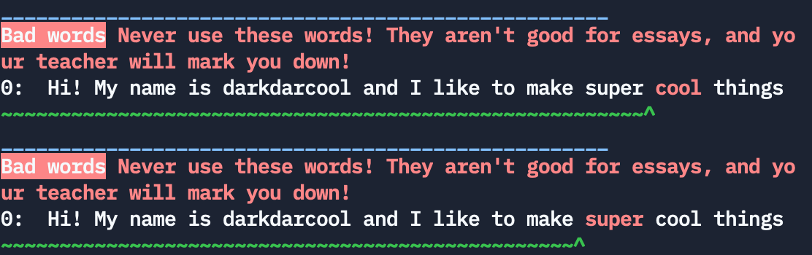

# DarkLint

_Hello!_ and welcome to DarkLint!

I know that summer in ending (`:(`), and people are returing to school! Recently I did too, and since I did well on the placement tests, I got a good teacher. Sadly on the first day, the teacher immediately started drilling us on what her writing standards were. I wrote them down to make sure to go back and check anything I was turning in with them, and they quickly reached 3 pages, and were getting bigger, and I know I would never be able to keep track of them. So I quickly got the idea for DarkLint. So I wouldn't have to keep track of every rule. It doesn't contain even 1/3 of all of the rules yet, but I hope eventually I get all of them in it. 

# Sample

```
	Hi! My name is darkdarcool and I like to eat super cool things
```

## Out:

</img>

## Conclusion

This is _very_ beta, and it kinda trash in a lot of ways, and doesn't have many words to flag. I hope you enjoy and it helps you!


# KTHXBAI

(hmmm, should KTHXBAI be flagged? god never thought i'd be asking myself these questions)